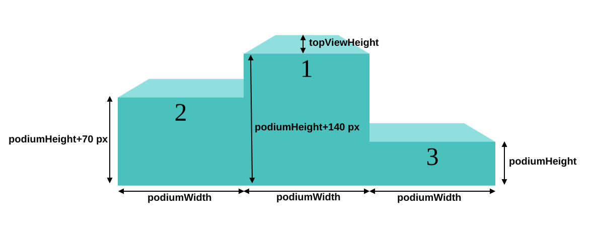
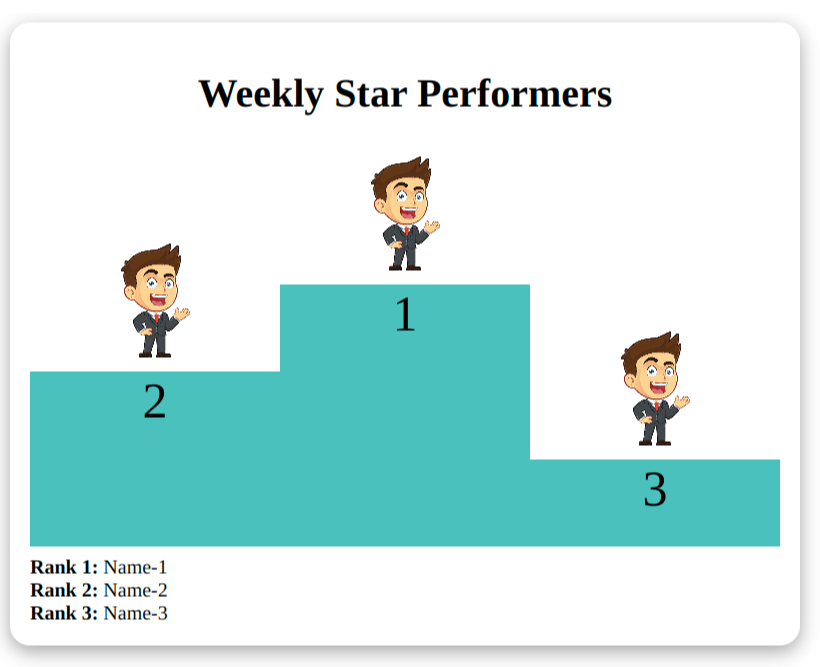
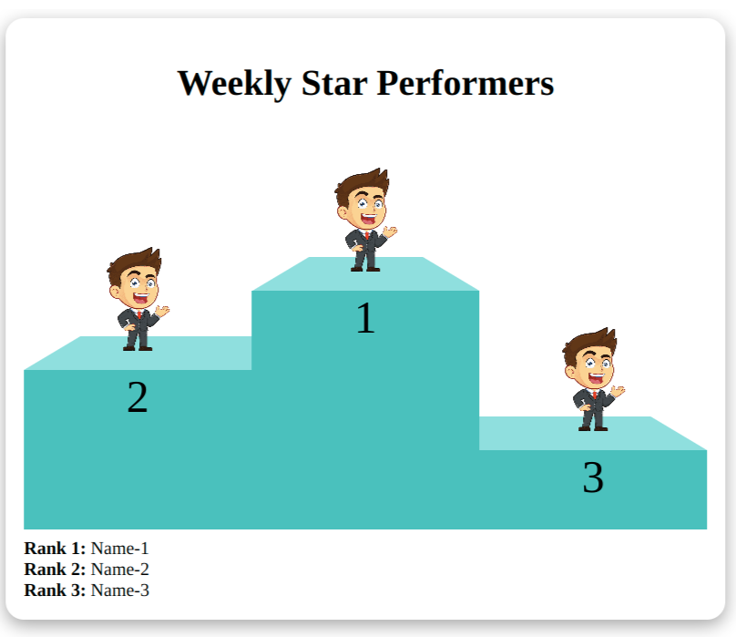

## Installation

`npm install winner-podium`

## Usage

```js
import { WinnersPodium } from "winner-podium";

<WinnersPodium
  options={{
    container: {
      style: {
        borderRadius: "1rem",
        boxShadow: "rgba(0, 0, 0, 0.35) 0px 5px 15px",
      },
      className: "",
    },
    podiumHeight: 70,
    podiumWidth: 200,
    backgroundColor: "rgb(2 193 189)",
    is3D: true,
    topViewHeight: 30,
    header: <h1>Weekly Star Performers</h1>,
    footer: (
      <div>
        <div>
          <b>Rank 1:</b> Name-1
        </div>
        <div>
          <b>Rank 2:</b> Name-2
        </div>
        <div>
          <b>Rank 3:</b> Name-3
        </div>
      </div>
    ),
    winners: {
      rank1: (
        
      ),
      rank2: (
        
      ),
      rank3: (
        
      ),
    },
  }}
/>;
```

## Preview

Hints:


2D:


3D:


## Options

You can pass the following options to `WinnersPodium`:

| Parameter       | Type                                                                 | Default        | Description                                         |
| --------------- | -------------------------------------------------------------------- | -------------- | --------------------------------------------------- |
| container       | object { style: object; className: string }                          |                | Provide style or className to the podium            |
| podiumHeight    | number                                                               | 70             | height of the smallest(rank-3) podium               |
| podiumWidth     | number                                                               | 100            | width of each rank podium                           |
| backgroundColor | string                                                               | rgb(2 193 189) | color of the podium. [Note: Add colors in rgb only] |
| is3D            | boolean                                                              | false          | Display the podium in 2D                            |
| topViewHeight   | number                                                               | 30             | height of top of the stand in 3D view               |
| header          | JSX.Element                                                          |                | Element to display at the top                       |
| footer          | JSX.Element                                                          |                | Element to display at the bottom                    |
| winners         | object { rank1: JSX.Element; rank2: JSX.Element; rank3:JSX.Element } |                | Winner's Details to show on the podium              |

## Sample config using all options

```js
{
  container: {
    style: {
      color: "white"
    },
    className: "winners-podium-container",
  },
  podiumHeight: 70,
  podiumWidth: 200,
  backgroundColor: "rgb(2 193 189)",
  is3D: true,
  topViewHeight: 30,
  header: <header>Header</header>,
  footer: <footer>Footer</footer>,
  winners: {
    rank1: <h4>Name-1</h4>,
    rank2: <h4>Name-2</h4>,
    rank3: <h4>Name-3</h4>,
  },
}
```

## Author

Find me on Linkedin:
https://www.linkedin.com/in/sushma-goswami-8550bb146/

## License

winner-podium is available under the [MIT license](LICENSE.md).
